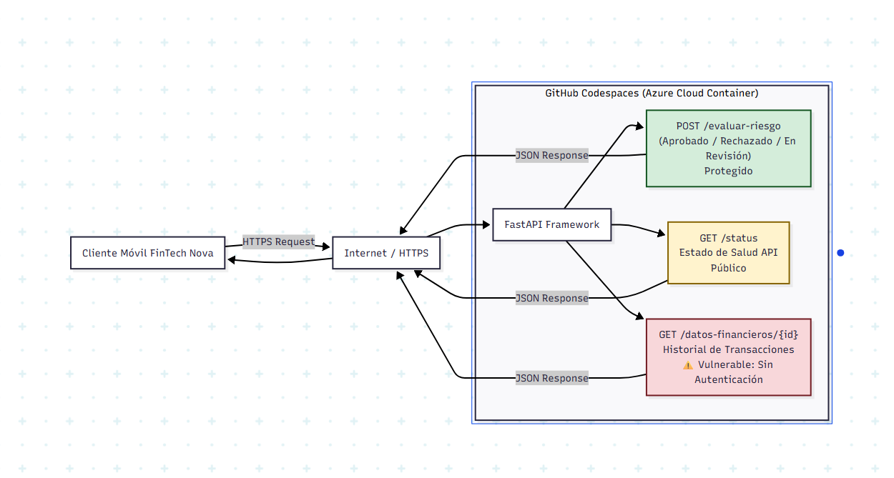

# FinTech Nova — Motor de Riesgo Crediticio

> API de evaluación de créditos — Roslaysoft Consulting

## Integrantes del Grupo

| Nombre | GitHub User | Rol |
|----------|----------|----------|
| Daniel_Alvarez | @df-alvarezj | Desarrollador |

## Laboratorio 1 — Estado: COMPLETADO

### URL del Codespace

https://curly-capybara-96gxw6rxqjv37j9v-8000.app.github.dev/

### Endpoints disponibles

| Endpoint | Método | Descripción |
|----------|----------|----------|
| /status | GET | Health check |
| /evaluar-riesgo | POST | Motor de riesgo |
| /datos-financieros/{id} | GET | Vulnerable |

### Diagrama Arquitectónico As-Is



## Cómo ejecutar

```bash
pip install -r requirements.txt
uvicorn main:app --host 0.0.0.0 --port 8000 --reload
```

## Laboratorio 2 — Estado: COMPLETADO

### Objetivo
Hardening de API y prevención de SQL Injection

### Endpoints disponibles
| Endpoint | Método | Descripción |
|----------|--------|-------------|
| /vulnerable/users/{username} | GET | Endpoint vulnerable a SQLi |
| /secure/users/{username} | GET | Endpoint protegido con prepared statements |

### Hallazgos de seguridad
- **SQLi demostrado:** payload `juan' OR '1'='1` expuso todos los usuarios incluyendo admin/superadmin
- **SQLi neutralizado:** el mismo payload en /secure/ devuelve lista vacía
- **Cabeceras de seguridad:** middleware con 5 cabeceras HTTP configuradas
- **Verificación:** securityheaders.com calificación C (limitación de Codespaces)

# Lab 3 — Automatización, Observabilidad y Contenedores
**Proyecto:** FinTech Nova — API de Evaluación Crediticia  
**Sesión:** 13 | Integración: Scripting → Health Checks → Docker

---

## Prerequisitos
- Git instalado
- Docker instalado (`docker --version` para verificar)
- Python 3.11+
- GitHub Codespaces (o cualquier servidor Linux)

---

## Configuración Inicial

```bash
# 1. Clonar el repositorio
git clone https://github.com/df-alvarezj/Semanario-tecnologo-2026.git
cd Semanario-tecnologo-2026

# 2. Cambiar a la rama del lab
git checkout lab3-automatizacion-docker

# 3. Crear entorno virtual e instalar dependencias
python3 -m venv venv
source venv/bin/activate
pip install -r requirements.txt
```

---

## Bloque 1 — Scripts de Automatización

### backup_db.sh — Backup automático de la base de datos
```bash
# Dar permisos y ejecutar
chmod +x backup_db.sh
./backup_db.sh

# Verificar que el backup se creó
ls -lh backups/
```

### Automatizar con Cron (cada día a las 2AM)
```bash
crontab -e
# Agregar esta línea:
0 2 * * * /workspaces/Semanario-tecnologo-2026/backup_db.sh >> /tmp/backup.log 2>&1

# Verificar que quedó guardado
crontab -l
```

### log_analyzer.py — Detector de SQL Injection
```bash
python3 log_analyzer.py server.log
```

### resource_monitor.sh — Monitor de recursos del sistema
```bash
chmod +x resource_monitor.sh
./resource_monitor.sh
```

---

## Bloque 2 — Observabilidad

### Iniciar la API localmente
```bash
uvicorn main:app --reload --host 0.0.0.0 --port 8000
```

### Consultar el Health Check
```bash
curl -s http://localhost:8000/health | python3 -m json.tool
```

### Respuesta esperada
```json
{
  "status": "healthy",
  "checks": {
    "database": {"status": "ok"},
    "disk":     {"status": "ok"},
    "backup":   {"status": "ok"},
    "memory":   {"status": "ok"}
  }
}
```

---

## Bloque 3 — Contenedor Docker

### Construir la imagen
```bash
docker build -t fintech-nova:1.0 .
```

### Ejecutar el contenedor
```bash
docker run -d -p 8000:8000 --name fintech-api fintech-nova:1.0
```

### Verificar que está corriendo
```bash
docker ps
curl -s http://localhost:8000/health | python3 -m json.tool
```

### Ver logs del contenedor
```bash
docker logs -f fintech-api
```

### Detener y eliminar el contenedor
```bash
docker stop fintech-api
docker rm fintech-api
```

---

## Solución de Problemas

**ERROR: `port is already allocated`**  
El puerto 8000 ya está en uso por uvicorn local.  
Solución: `pkill -f uvicorn` antes de ejecutar el contenedor.

**ERROR: `ModuleNotFoundError` al iniciar el contenedor**  
Falta una librería en requirements.txt.  
Solución: `pip freeze > requirements.txt` y reconstruir con `docker build`.

**ERROR: Health check siempre en `starting` o `unhealthy`**  
El endpoint /health no responde dentro del contenedor.  
Diagnóstico: `docker exec -it fintech-api curl -v http://localhost:8000/health`

---

## Archivos del Laboratorio

| Archivo | Descripción |
|---------|-------------|
| `backup_db.sh` | Backup automático de database.db con retención 7 días |
| `log_analyzer.py` | Detecta intentos de SQL Injection en server.log |
| `health_check.py` | Verifica BD, disco, backup y memoria RAM |
| `resource_monitor.sh` | Monitor de uso de CPU, RAM y disco |
| `Dockerfile` | Empaqueta la API en contenedor seguro con usuario no-root |
| `.dockerignore` | Excluye archivos innecesarios de la imagen Docker |

# Lab 4 — CI/CD Pipeline con GitHub Actions y DevSecOps

> **Sesión 14 · FinTech Nova · Automatización del flujo de entrega con controles de seguridad Shift-Left**

---

## Información del Lab

| Campo | Detalle |
|-------|---------|
| **Rama** | `lab4-cicd-devops` |
| **Sesión** | 14 — CI/CD y Despliegue Continuo |
| **Prerequisitos** | Lab 2 (hardening-api) · Lab 3 (docker) |
| **Herramientas** | GitHub Actions · pip-audit · Docker |
| **Tiempo estimado** | 45–60 minutos |

---

## Objetivo

Implementar un pipeline CI/CD automatizado que integra controles de seguridad **Shift-Left**, de modo que ningún código con vulnerabilidades conocidas pueda llegar a producción.

---

## Estructura de Archivos Creados

```
fintech-nova/
│
├── .github/
│   └── workflows/
│       └── ci-cd-pipeline.yml   ← ⭐ El pipeline que creamos
│
├── app/                         ← Código de la API (labs anteriores)
├── Dockerfile                   ← Del Lab 3
└── requirements.txt             ← Dependencias de Python
```

---

## Pasos del Pipeline

El pipeline se activa automáticamente con cada `git push` a la rama `main` y ejecuta 5 pasos en secuencia:

```
PUSH → [A] Checkout → [B] Python 3.11 → [C] Dependencias → [D] pip-audit 🔒 → [E] Docker Build 🐳
                                                                     ↓
                                                            Si falla → ❌ STOP
                                                            (código no avanza)
```

| Paso | Nombre | Propósito |
|------|--------|-----------|
| **A** | Checkout | Descarga el código a la VM de GitHub |
| **B** | Configurar Python 3.11 | Garantiza la versión exacta del entorno |
| **C** | Instalar dependencias | `pip install -r requirements.txt` |
| **D** | **pip-audit** 🔒 | Auditoría de seguridad — **Shift-Left** |
| **E** | Docker build | Construye la imagen etiquetada con el SHA del commit |

---

## Comandos para Ejecutar el Lab

### 1. Crear y cambiar a la rama del lab
```bash
git checkout -b lab4-cicd-devops
```

### 2. Crear la estructura de carpetas
```bash
mkdir -p .github/workflows
```

### 3. Crear el archivo del pipeline
Copia el contenido de `.github/workflows/ci-cd-pipeline.yml` a esa ruta.

### 4. Subir los cambios y activar el pipeline
```bash
git status
git add .github/workflows/ci-cd-pipeline.yml
git commit -m "feat: agregar pipeline CI/CD con auditoría de seguridad pip-audit"
git push origin lab4-cicd-devops
```

> ⚠️ **Nota:** Si el pipeline está configurado para activarse en `main`, deberás hacer un Pull Request desde `lab4-cicd-devops` → `main`, o ajustar el disparador para incluir tu rama durante el desarrollo.

---

## Monitorear el Pipeline en GitHub

1. Abre tu repositorio en **github.com**
2. Haz clic en la pestaña **Actions**
3. Selecciona la ejecución más reciente

### Estados posibles

| Icono | Estado | Significado |
|-------|--------|-------------|
| 🟡 | En progreso | El pipeline está corriendo — puedes ver logs en tiempo real |
| ✅ | Exitoso | Todo pasó. Imagen Docker construida y verificada. |
| ❌ | Fallido | Algún paso falló. El código **no** avanzó. Lee los logs. |

---

## DevSecOps en Acción: pip-audit

`pip-audit` compara las dependencias de `requirements.txt` contra las bases de datos de vulnerabilidades **OSV** (Google) y **NVD** (gobierno de EE.UU.).

### Ejemplo de vulnerabilidad detectada
```
requests 2.25.0 affected by GHSA-j8r2-6x86-q33q
Fixed in: requests 2.31.0
Error: pip-audit exited with code 1
```

**Cómo corregirlo:** En `requirements.txt`, cambia:
```
requests==2.25.0   # ❌ vulnerable
```
por:
```
requests==2.31.0   # ✅ seguro
```
Luego: `git add requirements.txt && git commit -m "fix: actualizar requests a versión segura" && git push`

---

## Conceptos Clave Aplicados

| Concepto | Implementación en este lab |
|----------|--------------------------|
| **CI (Integración Continua)** | Pipeline se ejecuta en cada push automáticamente |
| **DevSecOps** | pip-audit integrado como guardián de seguridad |
| **Shift-Left** | Seguridad verificada *antes* de construir la imagen |
| **Romper el Build** | Pipeline se detiene si pip-audit detecta vulnerabilidades |
| **Trazabilidad** | Imagen etiquetada con `${{ github.sha }}` |

---

## Conexión con Labs Anteriores

| Lab | Lo que aportó | Cómo se usa aquí |
|-----|--------------|------------------|
| **Lab 2** — Hardening API | API Flask con controles de seguridad | El código que el pipeline protege y verifica |
| **Lab 3** — Docker | `Dockerfile` funcional | El pipeline usa este Dockerfile en el Paso E |
| **Lab 4** — CI/CD *(este)* | Pipeline GitHub Actions + pip-audit | Orquesta y automatiza todo el proceso |

---

## Criterios de Éxito

- [ ] Archivo `.github/workflows/ci-cd-pipeline.yml` creado con indentación correcta
- [ ] Pipeline visible en la pestaña **Actions** del repositorio
- [ ] Al menos una ejecución con estado ✅ **Exitoso**
- [ ] pip-audit corrió sin encontrar vulnerabilidades (o las corregiste)
- [ ] Imagen Docker construida con tag `fintech-nova:<SHA>`

---

## Ejercicio Extra (Opcional)

Agrega un paso de análisis estático con **Bandit** (herramienta de seguridad para Python):

```yaml
- name: "🛡️ Análisis Estático de Seguridad (Bandit)"
  run: |
    pip install bandit
    bandit -r app/ -ll
```

Inserta este paso **antes** del paso de Docker build. El flag `-ll` hace que Bandit solo rompa el build en vulnerabilidades de **severidad media o alta**.

---

*Lab 4 — Sesión 14 · FinTech Nova · CI/CD y DevSecOps*
